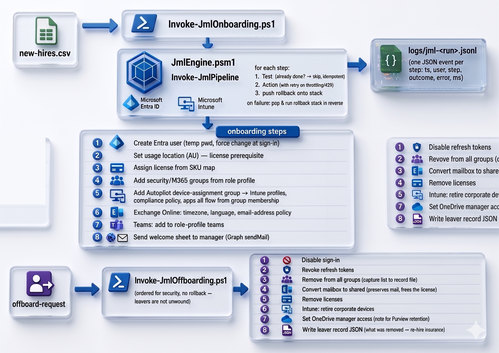
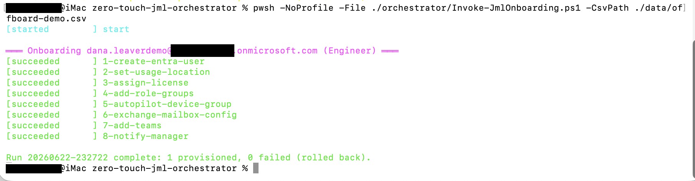
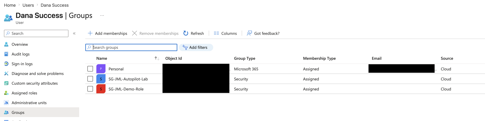
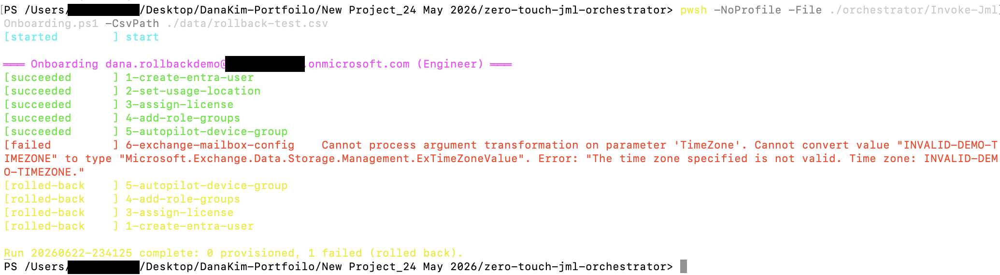
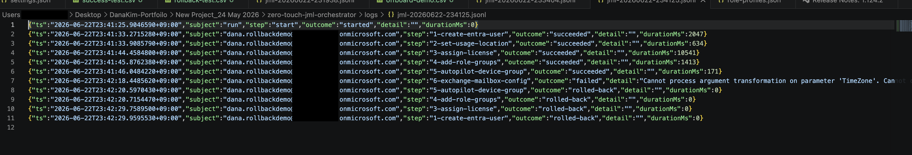
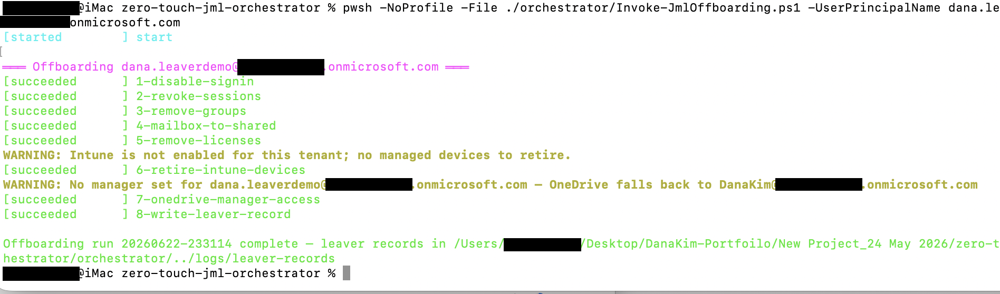
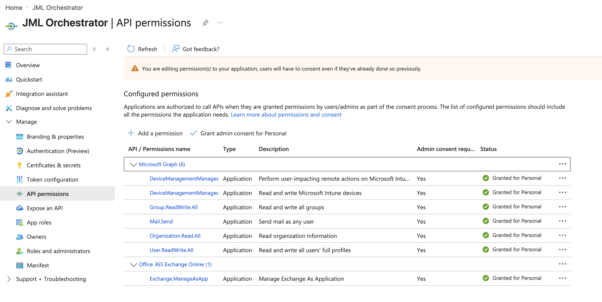

# Zero-Touch JML Orchestrator

End-to-end joiner/mover/leaver automation built as a **step pipeline with rollback**: Entra ID account → license → groups → Intune/Autopilot device enrollment groups → Exchange Online mailbox config → Teams membership, each step logged, retried, and reversible. If step 6 of 8 fails, the orchestrator unwinds the completed steps in reverse order instead of leaving a half-provisioned ghost account.

> Sibling project: [`entra-onboarding-automation`](../entra-onboarding-automation) is the straightforward script version (create → license → group). This project is the production-shaped version of the same problem: orchestration engine, idempotency, rollback, structured logging, and the device layer (Autopilot/Intune) that makes onboarding genuinely *zero-touch* — the laptop ships sealed from the supplier and builds itself at the user's kitchen table.

## Purpose

Australian MSP job ads treat "Autopilot + Intune zero-touch provisioning" as near non-negotiable. The hard part isn't calling the APIs — it's what happens when call 6 of 8 fails at 5pm on a Friday. This project's value is the failure engineering: every step declares its own rollback, every run writes a JSONL audit trail, and re-running a half-finished user is safe because every step checks state before acting (idempotency).

## Architecture



CSV in → `JmlEngine.psm1` runs an 8-step pipeline per user: each step is *test → act → push rollback*, so a re-run skips work already done (idempotent) and a failure unwinds the completed steps in reverse. Offboarding runs a fixed, security-ordered sequence (no rollback — leavers are not unwound). Every step writes one JSON event to `logs/jml-<run>.jsonl`.

## Why the order matters (offboarding)

Disable **before** revoke: a revoked token can be re-acquired in seconds if the account can still sign in. Convert-to-shared **before** unlicensing: dropping the license first puts the mailbox in a 30-day soft-delete countdown. These orderings are the difference between "ran some commands" and "understands identity lifecycle."

## Walkthrough

**Onboarding — all 8 steps succeed.** One unattended run provisions the user end-to-end. Re-running the same CSV is safe: each step checks state first and skips what is already done (idempotent).



**Provisioned user in Entra.** The new starter lands with their role-profile groups attached — including the Autopilot device-assignment group that drives Intune enrollment. (Object IDs and email redacted.)



**Rollback on failure.** Step 6 fails on a bad Exchange timezone; the engine pops the rollback stack and unwinds steps 5 → 4 → 3 → 1 in reverse, leaving no half-provisioned account. Result line: `0 provisioned, 1 failed (rolled back)`.



**JSONL audit trail.** Every step emits one structured event (`ts, subject, step, outcome, detail, durationMs`) — including the failure detail and each rolled-back step — for the whole run.



**Offboarding — security-ordered sequence.** Disable → revoke tokens → strip groups → convert mailbox to shared → remove licenses → retire devices → set OneDrive manager access → write leaver record.



**App registration / Graph + Exchange permissions.** Application permissions with admin consent granted — the least-privilege set the pipeline actually uses.



## Tech stack

- PowerShell 7 · Microsoft Graph PowerShell SDK · ExchangeOnlineManagement (cert app-only for both)
- Microsoft Intune + Windows Autopilot (group-driven profile assignment)
- Role profiles as JSON (`config/role-profiles.json`) — sales hire vs engineer hire = one input field
- Graph scopes: `User.ReadWrite.All`, `Group.ReadWrite.All`, `DeviceManagementManagedDevices.PrivilegedOperations.All`, `Mail.Send`; EXO: `Exchange.ManageAsApp` + Exchange Recipient Management role

## Repo structure

```
zero-touch-jml-orchestrator/
├── README.md
├── .gitignore
├── orchestrator/
│   ├── lib/JmlEngine.psm1            # pipeline engine: steps, retry, rollback, JSONL log
│   ├── Invoke-JmlOnboarding.ps1      # CSV in → 8-step pipeline per user
│   └── Invoke-JmlOffboarding.ps1     # UPN(s) in → ordered leaver sequence
├── config/
│   ├── role-profiles.sample.json     # role → groups, teams, license SKU, autopilot group
│   └── settings.sample.json          # tenant/app/cert, org defaults
├── data/
│   └── new-hires.sample.csv
└── docs/
    ├── autopilot-intune-setup.md     # the device half: Autopilot profile, enrollment, ESP
    └── screenshot-checklist.md
```

## Quick start

```powershell
Install-Module Microsoft.Graph, ExchangeOnlineManagement -Scope CurrentUser
Copy-Item config/settings.sample.json config/settings.json          # fill in
Copy-Item config/role-profiles.sample.json config/role-profiles.json

# Dry run first — prints the step plan per user, touches nothing
./orchestrator/Invoke-JmlOnboarding.ps1 -CsvPath data/new-hires.csv -WhatIf

./orchestrator/Invoke-JmlOnboarding.ps1 -CsvPath data/new-hires.csv
./orchestrator/Invoke-JmlOffboarding.ps1 -UserPrincipalName leaver@contoso.com
```

## Resume-ready outcome line

> Designed a zero-touch provisioning workflow with Autopilot and Intune orchestrated by a PowerShell pipeline engine with per-step rollback and JSONL audit logging, reducing new-starter setup from ~4 hours of portal work to a 30-minute unattended run.
